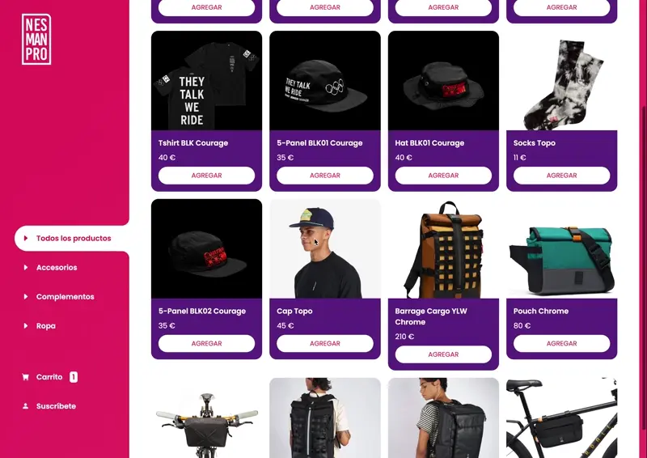

# Online Store Project

This project is a fully developed online store using fundamental web technologies like Vanilla JavaScript, HTML, and CSS. It focuses on providing a seamless and engaging shopping experience for users interested in cycling-related products. From accessories to clothing, the store offers a wide variety of products to meet customers' needs.

## Key Features

- **Responsive Interface**: The online store is designed to be compatible with devices of different sizes, allowing users to browse and make purchases from their mobile devices, tablets, or desktop computers.

- **Shopping Cart Management**: With a pure JavaScript implementation, users can add products to their shopping cart, view the purchase summary, and easily make purchases.

- **User Authentication**: The project includes a registration and login system so that users can create an account, log in, and access their profile details for a more personalized shopping experience.

- **Form Validation**: Form validations are applied both in the registration process and other forms related to the purchase, ensuring that user-provided data is correct and valid.

- **Browser Data Persistence**: Shopping cart data and other user details are stored locally in the client's browser, allowing for a seamless shopping experience even when refreshing or closing the browser.

## Technologies Used

- **HTML/CSS**: For the website's structure and design.
- **JavaScript**: For client-side interaction logic, such as shopping cart management and form validation.
- **Bootstrap Icons**: For including icons in the website design.
- **SweetAlert2 and Toastify**: For displaying attractive pop-up messages and notifications to the user.

## Installation and Usage

1. Clone this repository to your local machine.
2. Open the `index.html` file in your web browser to start exploring the online store.
